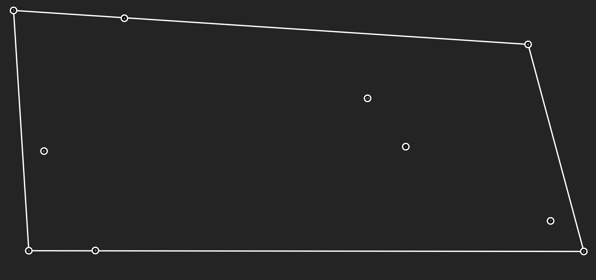

# Geometría Computacional.
Práctica 01. Implementación del algoritmo EXTREME POINTS para encontrar la envolvente convexa de una nube de puntos.

La realización de esta práctica fue pensada en una implementación para concursos de programación competitiva, así que no se siguieron buenas prácticas de programación.
## Autor.
- Adrian Aguilera Moreno.
- Cta. `421005200`.
- Correo. `aguilera@ciencias.unam.mx`.
- GitHub. `@Aguilera450`.
## Especificaciones de uso:
Se debe utilizar el compilador `g++ (GCC) 12.2.1` con la versión indicada o superior. Se deben usar las especificaciones de la práctica.
## Instrucciones:
1. Generar los puntos por medio de Visualization Helper y guardarlos en un archivo llamado `puntos.txt`.
2. El archivo `puntos.txt` debe estar en el directorio `Practica01`.
3. Compilar desde terminal con `g++ Practica01.cpp`, lo cuál generará un ejecutable `a.out`.
4. Ejecutar el archivo compilado desde terminal `./a.out`.
5. Se generará un archivo `cierreConvexo.txt` en el directorio `Practica01`.
6. Ingresar el archivo `cierreConvexo.txt`en Visualization Helper con el botón Upload Solution.
## Ejecución:
Se da una nube de puntos, en este caso 10 puntos que se encuentran en el archivo: `puntos.txt`.

Se ejecuta el algoritmo EXTREME POINTS y se genera el siguiente cierre convexo:

Este algoritmo tiene una complejidad contenida en O(n^4) lo cuál es un orden muy grande en comparación al algoritmo de Graham para encontrar envolventes convexas (Graham lo hace en O(n log_2 n)). Sin embargo, es una buena primera aproximación a algoritmos en Geometría Computacional.
## Consultas:
Para esta práctica realice consultas extras al laboratorio, a continuación se muestran las referencias a los sitios de consulta:
- [Lectura de archivos en C++.](https://aprende.olimpiada-informatica.org/algoritmia-geometria-computacional)
- [Escritura de archivos en C++.](https://parzibyte.me/blog/2020/09/11/escribir-archivo-texto-cpp/)
- [Convertir una string a int en C++.](https://www.techiedelight.com/es/convert-string-to-int-cpp/)
- [Geometría Computacional | Aprende Programación Competitiva.](https://aprende.olimpiada-informatica.org/algoritmia-geometria-computacional)